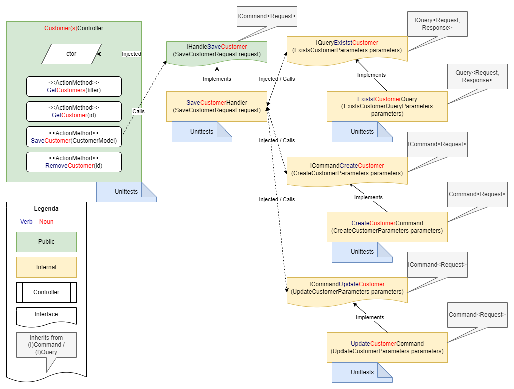

 

# Peereflits.Shared.Commanding

This library aims to stimulate and simplify the use of two [design patterns](https://en.wikipedia.org/wiki/Software_design_pattern). These are:
1. [Command pattern](https://en.wikipedia.org/wiki/Command_pattern)
1. [Command/Query separation](https://en.wikipedia.org/wiki/Command%E2%80%93query_separation) (CQS)

The library only contains abstract classes and interfaces. By inheriting these `abstract classes` in implementations, the use of CQS is more consciously applied and you get the *command pattern* for free. To avoid confusion, both a CQS query and a CQS command implement the command pattern.

## Command pattern

The generally recognized definition of the *command pattern* states that a command contains all the data it needs to perform an action. "All data" consists of the (execution) context and the "state" in the command itself. This corresponds to what is stated in some coding guidelines: [Classes should have state and behavior](https://csharpcodingguidelines.com//class-design-guidelines/#AV1025). But that then seems to contradict the "cloud native" adage "services should be stateless". You often see in *command pattern* implementations that a command has an `Execute()` method. In this implementation it was decided to make the execution context available in a command via Dependency Injection and to pass the "state" as a parameter to `Execute()`. This makes "statefulness" easier to prevent. Furthermore, a command, in this implementation, also has a `CanExecute()`, so that you can naturally keep validation logic and execution logic separate from each other. See this (speudo) code:

``` csharp
interface ICommand
{
   bool CanExecute(parameters);
   Task/void Execute(parameters);
}
```

The validation logic in `CanExecute` performs context validation (on the injected services) and input validation on the `parameters`. The execution logic calls `CanExecute` and if it passes the command is executed.


## Command/Query separation

The value of the Command/Query separation (CQS) principle is well known and is stated on [wikipedia](https://en.wikipedia.org/wiki/Command%E2%80%93query_separation) and by [Martin Fowler](https://martinfowler.com/bliki/CommandQuerySeparation.html) is described in detail. Commands and queries defined as:
* **Queries:** return a result and do not change the observable state of the system (are free of side effects).
* **Commands:** change the state of a system but do not return a value.

> **Note:** This is *not* the [CQRS pattern](https://learn.microsoft.com/en-us/azure/architecture/patterns/cqrs) | [Martin Fowler](https://www.martinfowler.com/bliki/CQRS.html)

This library contains a number of `abstract classes` that realize this principle/pattern by implementing the following `interfaces` (=pseudo code):

``` csharp
public interface ICommand 
{
    Task<bool> CanExecute();
    Task Execute();
}
public interface ICommand<in TRequest>
{
    Task<bool> CanExecute(TRequest request);
    Task Execute(TRequest request);
}
public interface IQuery<TResponse> : IExecutable
{
    Task<bool> CanExecute();
    Task<TResponse> Execute();
}
public interface IQuery<in TRequest, TResponse>
{
    Task<bool> CanExecute(TRequest request);
    Task<TResponse> Execute(TRequest request);
}
```

**Note:** This is not the exact implementation.

All commands and queries are asynchronous and contain no business logic. To use CQS, implementations must implement one of the abstract classes. These are:
1. **Command**: a basic CQS command;
1. **Query**: a basic CQS query;
1. **LoggedCommandHandler**: a CQS command with built-in logging that acts as a *Handler*;
1. **LoggedCommandService**: a CQS command with built-in logging that acts as a *Service*;
1. **LoggedQueryHandler**: a CQS query with built-in logging that serves as a *Handler*;
1. **LoggedQueryService**: A CQS query with built-in logging that acts as a *Service*.

Every command and query has a type-parameterized counterpart.

## Services & Handlers

In this library an explicit distinction is made between services and handlers. However, this distinction is semantic (within this library) as logically (and in terms of implementation in this library) there is no difference. But services and handlers (in their final implementation) *do* have different responsibilities.

A "Service" is the workhorse of the business logic:
* has a single responsibility (see [Single Responsibility Principle](https://en.wikipedia.org/wiki/Single-responsibility_principle));
* is stateless;
* is idempotent;
* is atomic;
    * but not transactional.

Examples of a service are:
* a database query;
* executing a database command;
* read a blob;
* write a blob;
* call a web service;
* retrieve a secret;
* perform a calculation.

A "Handler", on the other hand, represents a Use Case or a business process. It:
* is an orchestrator of (injected) services;
* handles exceptions;
   * except transient exceptions: these can be handled in a service;
* is a "transaction boundary";
    * it can be a "Long running transaction" (not necessarily a database transaction - that can be executed in a database command);
    * triggers a "compensating transaction" if the long running transaction fails;
* is idempotent.

An example of a handler is a "CreateNewEmployeeHandler":
1. Validates whether the employee to be created exists (= injected service);
1. Creates the new employee in the IAM (Identity- & Access Management system) -AAD, Identity Server- (= injected service);
1. Creates the new employee in the HRM system (= injected service);
1. Sends a welcome email with instructions (= injected service);
1. If one of the previous three steps fails:
    1. Removes the new employee from the HRM system if present (= injected service);
    1. Removes the new employee from the IAM (= injected service).

A very important rule here is that handlers are not allowed to call other handlers. If this were to happen, the "Transaction boundary" would become diffuse and unmanageable. Handlers should also be stateless. And because all the injected services are stateless, the probability of a handler needing "state" is very small.

Schematically, the relationship between commands, queries, services and handlers can be represented as follows:

<br />*Commands, queries, services & handlers*


## Examples

An example of a parameterless query service:

``` csharp
internal interface IQueryGetAllCustomers : IQuery<IEnumerable<Customer>> { }

internal class GetAllCustomersQuery : LoggedQueryService<IEnumerable<Customer>>, IQueryGetAllCustomers
{
    ...
    
    public override string CommandName => nameof(GetAllCustomersQuery);

    public override async Task<IEnumerable<Customer>> OnExecute() 
    {
        // Implementation of the query
    }
}
```

**Note**: `IEnumerable<Customer>` is the result of the query.

An example of a parameterized service query:

``` csharp
public class GetCustomerParameters : IRequest
{
    // All properties are parameters of the query
}

internal interface IQueryGetCustomer : IQuery<GetCustomerParameters, Customer> { }

internal class GetCustomerQuery : LoggedQueryService<GetCustomerParameters, Customer>, IHandleGetCustomer
{
    ...

    public override string CommandName => nameof(GetCustomerQuery);

    public override async Task<bool> CanExecute(GetCustomerParameters parameters) 
    {
        // Validate parameters and return true if valid.
    }    

    protected override async Task<Customer> OnExecute(GetCustomerParameters parameters)
    {
        // Implementation of the query
    }
}
```

Note that `Customer` is the result of the query and `GetCustomerParameters` is a DTO/POCO containing all the inputs (such as ID) needed to run the query.

An example of a parameterized command as a handler:

``` csharp
public class CreateCustomerRequest : IRequest
{
    // All properties are parameters of the command
}

public interface IHandleCreateCustomer : ICommand<CreateCustomerRequest> { }

internal class CreateCustomerHandler : Command<CreateCustomerRequest>, IHandleCreateCustomer
{
    ...
    public CreateCustomerHandler
    (
        IQueryGetCustomer getCustomerQuery,
        ICommandCreateCustomer createCustomerCommand,
        ICommandRemoveCustomer removeCustomerCommand,
        ICommandSendEmail sendEmailCommand
    )
    {
      ...        
    }

    public override string CommandName => nameof(CreateCustomerHandler);

    public override async Task<bool> CanExecute(CreateCustomerRequest request)
           => return await getCustomerQuery.CanExecute(new GetCustomerParameters(...))
                  && await createCustomerCommand.CanExecute(new CreateCustomerParameters(...))
                  && await sendEmailCommand.CanExecute(new SendEmailParaemeters(...));

    protected override async Task OnExecute(CreateCustomerRequest request)
    {
        if(await getCustomerQuery.Execute(new GetCustomerParameters(...)) != null)
        {
            return;
        }

        try
        {
            await createCustomerCommand.Execute(new CreateCustomerParameters(...))
            await sendEmailCommand.Execute(new SendEmailParaemeters(...));
        }
        catch(AnyException ex)
        {
            await removeCustomerCommand.Execute(new RemoveCustomerParaemeters(...));
            throw;
        }
    }

    // This method is invoked during "Execute" when "CanExecute" returns false.
    // It is the result of validation errors and can be used to throw custom or more specialized exceptions.
    protected override void OnCommandException(CreateCustomerRequest request)
    {
         if(string.IsNullOrWhiteSpace(request.CustomerName))
         {
             throw new RequiredFieldIsMissingException(nameof(request.CustomerName));
         }

         base.OnCommandException(request);
    }
}
```

<br/><br/>

### Version support

This library supports the following .NET versions:
1. netstandard2.0
1. netstandard2.1
1. .NET 6.0
1. .NET 7.0
1. .NET 8.0

---

<p align="center">
&copy; No copyright applicable<br />
&#174; "Peereflits" is my codename.
</p>

---
